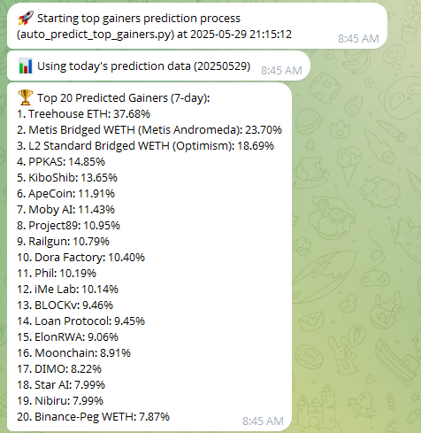

# Crypto Analytics and Prediction Framework

This program is designed to communicate with CoinGecko's API and collect daily statistics on top cryptocurrencies. It loads the data into temporary JSON files, then converts and saves it as CSV for later analysis.

## Overview
The main configuration file is "cgpulldailyV9.sh", which handles API connections and data downloading. You can create a batch file to autorun this script.

### Features
1. Data collection automation with Telegram alerts
2. Graph creation automation
3. Data processing steps for machine-readable data
4. General market data collection
5. Sentiment data collection
6. Crypto prediction model implementation that considers:
   - Historic performance
   - General market movement
   - Sentiment via RSS feeds
7. Backtesting implementation

### Future Updates
1. Reinforcement learning for prediction model using backtesting results
2. Research agent implementation
3. Automated trading features
4. Migration to a database (CSV files are filling up)

## Examples

### Backtesting Results

*Example of historical backtesting analysis and results.*

### General Market Fear & Greed Index

*Visual representation of the general cryptocurrency market sentiment.*

### Price Prediction

*Example of price prediction analysis for cryptocurrencies.*

### Sentiment Analysis

*Sentiment analysis from various crypto-related news and RSS feeds.*

## Contact Information
For more information, collaboration, or inquiries, please contact:
- Telegram: [@t850arnold](https://t.me/t850arnold)

## Contributors
- KommanderInKief (Initial version - 10/18/2021)
- skp225 (Updates and enhancements - 5/30/2025)
